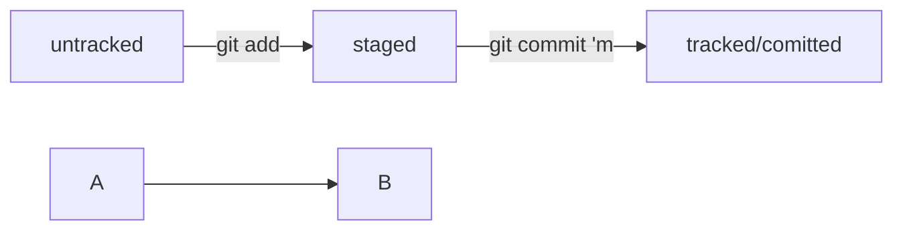

Навигация

pwd (от англ. <strong><em>p</em></strong><em>rint <strong>w</strong>orking <strong>d</strong>irectory</em>, «показать рабочую папку») — покажи, в какой я папке;

ls (от англ. <strong><em>l</em></strong><em>i<strong>s</strong>t directory contents</em>, «отобразить содержимое директории») — покажи файлы и папки в текущей папке;

ls -a — покажи также скрытые файлы и папки, названия которых начинаются с символа .;

cd first-project (от англ. <strong><em>c</em></strong><em>hange <strong>d</strong>irectory</em>, «сменить директорию») — перейди в папку first-project;

cd first-project/html — перейди в папку html, которая находится в папке first-project;

cd .. — перейди на уровень выше, в родительскую папку;

cd ~ — перейди в домашнюю директорию (/Users/Username);

cd / — перейди в корневую директорию.

Работа с файлами и папками

Создание

touch index.html (англ. touch, «коснуться») — создай файл index.html в текущей папке;

touch index.html style.css script.js — если нужно создать сразу несколько файлов, можно напечатать их имена в одну строку через пробел;

mkdir second-project (от англ. <strong><em>m</em></strong><em>a<strong>k</strong>e <strong>dir</strong>ectory</em>, «создать директорию») — создай папку с именем second-project в текущей папке.

Копирование и перемещение

cp file.txt ~/my-dir (от англ. <strong><em>c</em></strong><em>o<strong>p</strong>y</em>, «копировать») — скопируй файл в другое место;

mv file.txt ~/my-dir (от англ. <strong><em>m</em></strong><em>o<strong>v</strong>e</em>, «переместить») — перемести файл или папку в другое место.

Чтение

cat file.txt (от англ. <em>con<strong>cat</strong>enate and print</em>, «объединить и распечатать») — распечатай содержимое текстового файла file.txt.

Удаление

rm about.html (от англ. <strong><em>r</em></strong><em>e<strong>m</strong>ove</em>, «удалить») — удали файл about.html;

rmdir images (от англ. <strong><em>r</em></strong><em>e<strong>m</strong>ove <strong>dir</strong>ectory</em>, «удалить директорию») — удали папку images;

rm -r second-project (от англ. <strong><em>r</em></strong><em>e<strong>m</strong>ove</em>, «удалить» + <strong><em>r</em></strong><em>ecursive</em>, «рекурсивный») — удали папку second-project и всё, что она содержит.

Полезные возможности

Команды необязательно печатать и выполнять по очереди. Можно указать их списком — разделить двумя амперсандами (&&).

У консоли есть собственная память — буфер с несколькими последними командами. По ним можно перемещаться с помощью клавиш со стрелками вверх (<strong>↑</strong>) и вниз (<strong>↓</strong>).

Чтобы не вводить название файла или папки полностью, можно набрать первые символы имени и дважды нажать Tab. Если файл или папка есть в текущей директории, командная строка допишет путь сама.

 

Например, вы находитесь в папке dev. Начните вводить cd first и дважды нажмите Tab. Если папка first-project есть внутри dev, командная строка автоматически подставит её имя. Останется только нажать Enter.

💡 Команд так много — как их запомнить?

